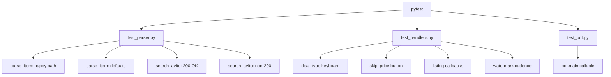

# Экзаменационный пакет по проекту `botavito13.0`

## 1) Что сделано
- Добавлены автотесты (`pytest`) для верификации и валидации ключевых модулей.
- Добавлены usability-проверки UI-элементов (inline-кнопки и логика watermark).
- Добавлен нагрузочный бенчмарк парсера с замером времени и потребления памяти.
- Подготовлена актуальная блок-схема проекта по текущему коду.

## 2) Структура добавленных файлов
- `tests/test_parser.py`
- `tests/test_handlers.py`
- `tests/test_bot.py`
- `tools/benchmark_parser.py`
- `docs/EXAM_REPORT.md`

## 3) Верификация (Verification)
Проверка, что код реализует ожидаемую логику:
- Корректный парсинг объявления в `parser._parse_item`.
- Корректные значения по умолчанию при неполных данных.
- Корректная обработка ответа API (200 и не-200 статусы).
- Наличие исполняемой точки входа `bot.main`.

Результат: `9 passed in 1.78s`.

## 4) Валидация (Validation)
Проверка, что система удовлетворяет пользовательским ожиданиям:
- Формат цены и текстовые поля в карточке объявления.
- Адрес и изображения корректно извлекаются из входного JSON.
- Обработка некорректных/пустых API-ответов без падения.

## 5) Юзабилити (Usability)
Проверки UX-элементов в Telegram-боте:
- Клавиатура выбора типа сделки (`Аренда`/`Покупка`) формируется корректно.
- Кнопка `Пропустить` для цены присутствует.
- Callback-идентификаторы `like_N` / `dislike_N` формируются правильно.
- Watermark отправляется предсказуемо (каждое 3-е действие).

## 6) Нагрузочные замеры: скорость и память
Тестовый контур: `python tools/benchmark_parser.py`

| Нагрузка (объявлений) | Время, сек | Скорость, объявл./сек | Пик памяти, МБ |
|---|---:|---:|---:|
| 10 | 0.000228 | 43,782.83 | 0.0075 |
| 100 | 0.001938 | 51,588.94 | 0.0637 |
| 1,000 | 0.019671 | 50,837.55 | 0.6319 |
| 5,000 | 0.101900 | 49,067.62 | 3.1654 |
| 10,000 | 0.223039 | 44,835.21 | 6.3332 |

Вывод:
- Время обработки масштабируется близко к линейному.
- Потребление памяти растет предсказуемо и пропорционально объему данных.

## 7) Блок-схема всего проекта


## 8) Подсхема тестов


## 9) Как запустить у себя
```bash
cd C:/Users/User/Desktop/botavito13.0
python -m pytest -q
python tools/benchmark_parser.py
```

## 10) Что можно улучшить дальше
- Добавить интеграционный тест хендлеров с эмуляцией FSM-сессии целиком.
- Вынести токены в `.env` и убрать секреты из кода.
- Добавить CI (GitHub Actions): автозапуск тестов и бенчмарка на PR.
